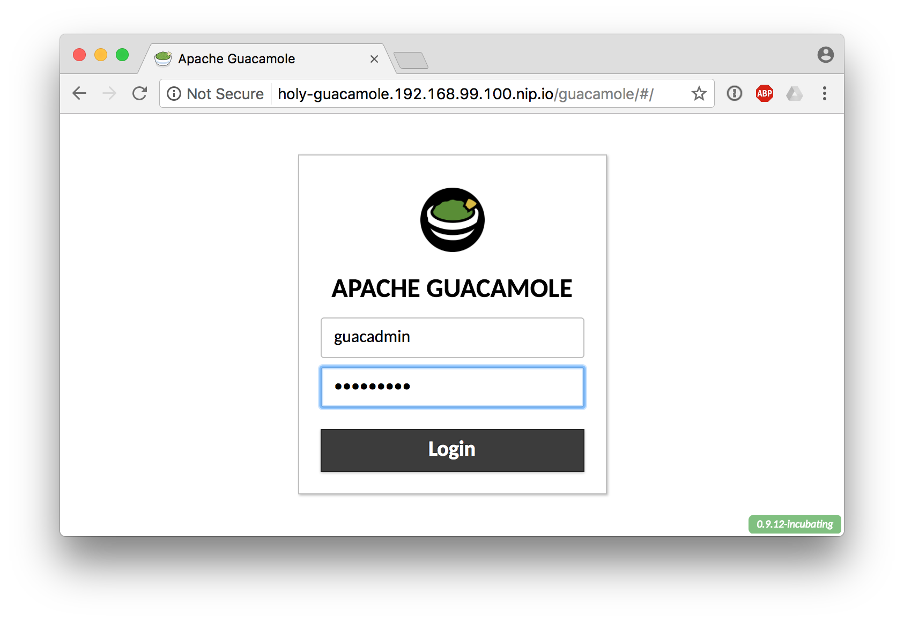
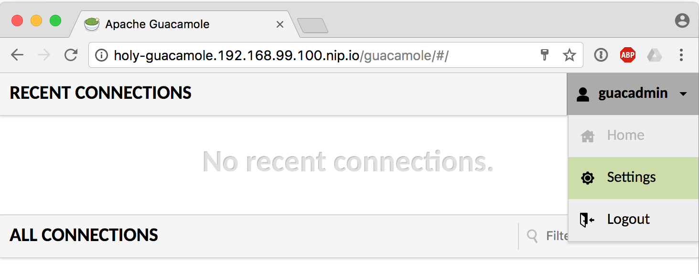
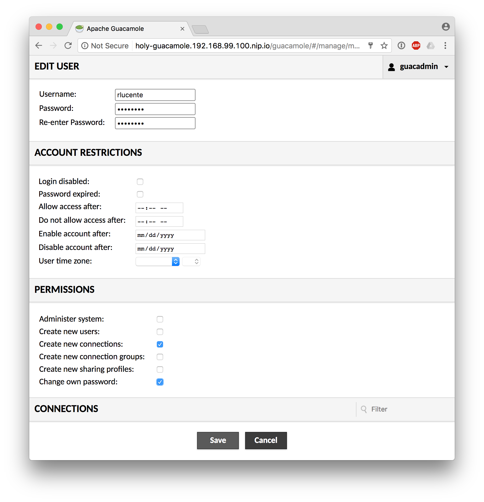
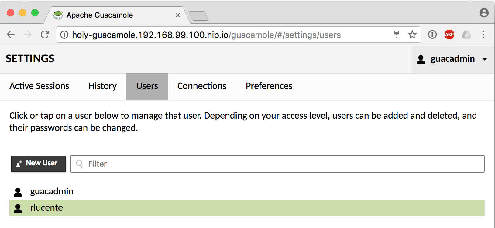
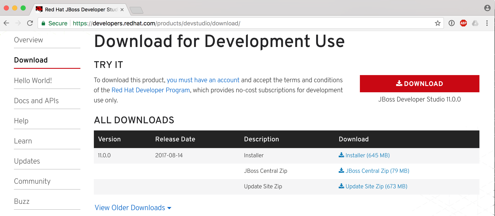
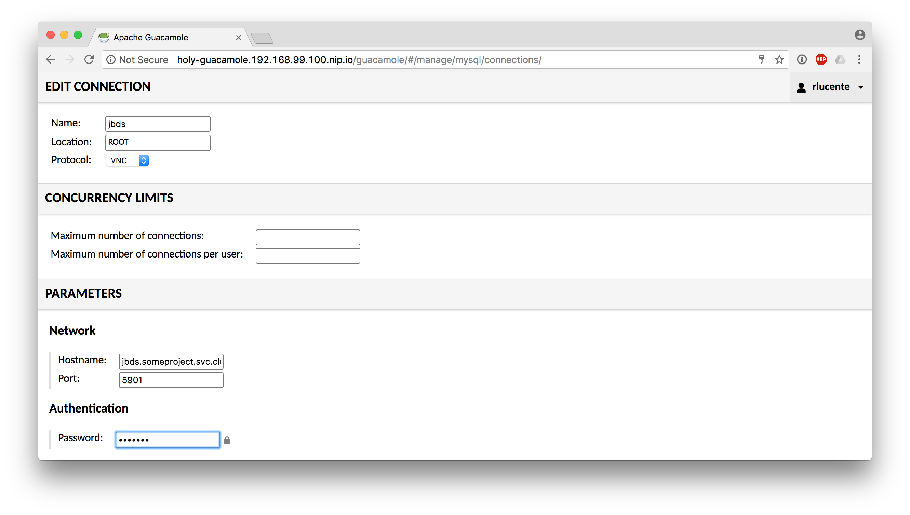
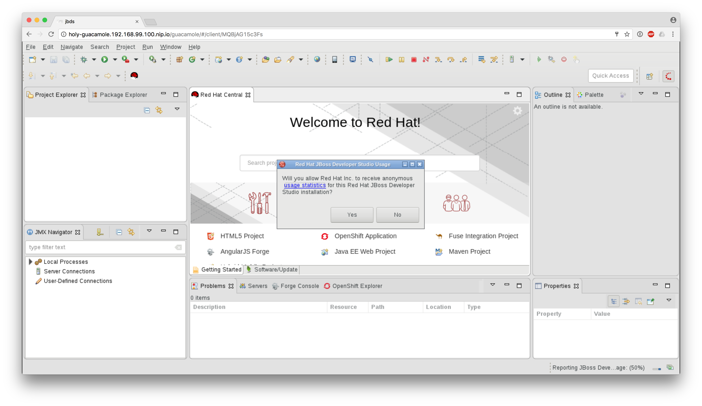

# Holy Guacamole!!
## Introduction
[Apache Guacamole](https://guacamole.incubator.apache.org/) is an
incubating Apache project that enables X window applications to be
exposed via HTML5 and accessed via a browser.  This article shows
how guacamole can be run inside containers in an OpenShift Container
Platform (OCP) cluster to enable [JBoss Developer Studio](https://developers.redhat.com/products/devstudio/overview/), the
eclipse-based IDE for the JBoss middleware portfolio, to be accessed
via a web browser.  You're probably thinking "Wait a minute... X
windows applications in a container?!!"  Yes, this is entirely
possible and this article will show you how.  Bear in mind that
tools from organizations like [CODENVY](https://codenvy.com/) can
provide a truly cloud ready IDE.  This article shows
how organizations that have an *existing well established IDE*
can rapidly provision developer environments where each developer
only needs a browser.  JBoss Developer Studio includes a rich set
of integration tools and I'll show how those can be added to a base
installation to support middleware products like [JBoss
Fuse](https://developers.redhat.com/products/fuse/overview/) and
[JBoss Data Virtualization](https://developers.redhat.com/products/datavirt/overview/).

## How does Apache Guacamole work?
Apache Guacamole consists of two main components, the guacamole web
application (known as the guacamole-client) and the guacamole daemon
(or guacd).  An X windows application runs in an Xvnc environment
with an in-memory only display.  The guacd daemon acts as an Xvnc
client, consuming the Xvnc events and sending them to the Tomcat
guacamole-client web application where they are then rendered to
the client browser as HTML5.  Guacamole also supports user
authentication, multiple sessions, and other features that this
article only touches on.  The [Apache Guacamole](https://guacamole.incubator.apache.org) web site has
more information.

## Login to OpenShift Container Platform
This was tested on a cloud-based OpenShift installation as well as
a laptop using the [Red Hat Container Development
Kit](https://developers.redhat.com/products/cdk/overview/).  This
article uses CDK 3, so please adjust accordingly if using an
alternative OpenShift Container Platform installation.  CDK3 leverages
the `minishift` command to stand up a virtual machine for OCP.

From a command line terminal, configure and start minishift:

    minishift setup-cdk --default-vm-driver virtualbox 
    minishift start --cpus 4 --disk-size 50g --memory 10240 --username 'RHN_USERNAME' --password 'RHN_PASSWORD'

Substitute the `RHN_USERNAME` and `RHN_PASSWORD` credentials above
with your login credentials from either the
[Red Hat Developer's Portal](https://developers.redhat.com) or
the [Red Hat Customer Service Portal](https://access.redhat.com).
You also may need to change the command line flags or set additional
command line flags for your environment.  You can see all the options
for the `minishift` commands by adding the `--help` option.

Make sure to add the `oc` command to your executable search path.
On my laptop, the path is `$HOME/.minishift/cache/oc/v3.5.5.8/oc`.
Use whatever path is appropriate for your minishift installation.
To automatically add the `oc` executable to your path, on Linux and
OSX you can type:

    eval $(minishift oc-env)

Once minishift has finished starting up, determine the IP address
for the minishift instance then login:

    IP_ADDR=$(minishift ip)
    oc login https://$IP_ADDR:8443 -u developer

For minishift, the password is 'developer'.

## Enabling Unprivileged Guacamole Client Containers
The guacamole project supplies Docker Hub images to simplify deploying
guacamole in a container.  However, the guacamole-client runs as a
privileged container by default.  A thin wrapper around the guacamole
image was created so it could run unprivileged within OpenShift.
Please refer to the
[guacamole-client-wrapper](https://github.com/rlucente-se-jboss/guacamole-client-wrapper)
project on github for more information on how this was done.  That
project was used to extend the `guacamole/guacamole` image on Docker
Hub to create the `rlucentesejboss/guacamole` image that is used
for the guacamole-client.

## Install the Guacamole Components
First, create a project for guacamole within the OpenShift Container
Platform.

    oc new-project guacamole

A persistent MySQL instance stores guacamole data including users
and their credentials.  Create the guacamole MySQL instance and
then modify it to use a persistent volume.  The MySQL database
persists users and connection parameters within guacamole.

    oc new-app mysql MYSQL_USER=guacamole MYSQL_PASSWORD=guacamole \
        MYSQL_DATABASE=guacamole
    oc volume dc/mysql --add --name=mysql-volume-1 -t pvc \
        --claim-name=mysql-data --claim-size=1G --overwrite

The guacamole image includes helper scripts for database initialization.
Run the guacamole image to create a database initialization script
for the MySQL database.  Use the `oc run` command to run the image
with an alternative start command.

    oc run guacamole --image=rlucentesejboss/guacamole --restart=Never \
        --command -- /opt/guacamole/bin/initdb.sh --mysql 

The `initdb.sh` command runs within a pod named `guacamole`.  When
the command completes, the MySQL initialization script will be in
the container log.  Put the initialization script into a SQL file
and remove the pod.

    oc logs guacamole > initdb.sql
    oc delete pod guacamole

At this point, the MySQL pod should be fully running, but it may
have restarted due to the deployment configuration change to add
the persistent volume claim.  Get the list of running pods to
determine the pod-id for MySQL.

    oc get pods

Identify the path to the MySQL client application within the pod.
To do that, type the following:

    oc rsh mysql-<pod-id>
    echo $PATH | cut -d: -f1
    exit

Use the pod-id and the executable path from the above command to
initialize the guacamole database:

    oc rsh mysql-<pod id> <exec-path>/mysql -h 127.0.0.1 -P 3306 \
        -u guacamole -pguacamole guacamole < initdb.sql

The above line initializes the MySQL database with all of the tables
and artifacts required to support guacamole.  Once the database is
initialized, create an application where both guacamole and guacd
are in a single pod.  The additional parameters will connect guacamole
to its database.

    oc new-app rlucentesejboss/guacamole+guacamole/guacd \
        --name=holy \
        GUACAMOLE_HOME=/home/guacamole/.guacamole \
        GUACD_HOSTNAME=127.0.0.1 \
        GUACD_PORT=4822 \
        MYSQL_HOSTNAME=mysql.guacamole.svc.cluster.local \
        MYSQL_PORT=3306 \
        MYSQL_DATABASE=guacamole \
        MYSQL_USER=guacamole \
        MYSQL_PASSWORD=guacamole

The last thing to do is expose a route for the guacamole application.

    oc expose service holy --port=8080 --path=/guacamole
    oc logout

## Configure Guacamole Users
Browse the the guacamole application.  On the CDK, the URL is
[holy-guacamole.192.168.99.100.nip.io/guacamole](holy-guacamole.192.168.99.100.nip.io/guacamole).
Make sure that the URL is appropriate for your environment.  The
login page for guacamole will appear.  Use the default username and
password of `guacadmin/guacadmin` as shown.

Once logged in, go to the upper right hand corner and select
"guacadmin -> Settings" in the drop down menu, as shown.

Select the "Users" tab and then click the "New User" button.

Set the username and password to whatever you desire.  As an
administrator, you can create multiple user accounts that can use
guacamole to connect to their own instances of JBoss Developer
Studio.  Also, grant the permissions "Create new connections" and
"Change own password".  Click "Save" to add the user.

Log out of the guacamole web application.

The user is now configured to create a connection to their instance
of JBoss Developer Studio and access it via a browser.  Now let's
build the JBDS container image and corresponding imagestream.

## Build the JBDS Application
As an OCP administrator, build the JBoss Developer Studio container
image and place the imagestream in the `openshift` namespace so
that all users can access it.  To limit the size of the container
image, the JBDS installer file is downloaded at build time and then
deleted after use.

Get the appropriate URL for the JBoss Developer Studio installer.
This has been tested against version 10.4.0.GA of the installer.
To get the URL, browse to [https://developers.redhat.com/products/devstudio/download/](https://developers.redhat.com/products/devstudio/download/).

Click the `Stand-Alone` download link for version 10.4.0.GA, as shown.

The web site will prompt you to log in.  Use your credentials (or
register if you haven't yet done so) and then cancel the download
when it starts.  Within the "Thank you..." box on the page, copy
the link location for `direct link`, as shown.

Build the image and create the imagestream.  Make sure to paste the
`direct link` URL as directed in the command below.

    oc login https://192.168.99.100:8443 -u system:admin

    oc project openshift

    oc new-build https://github.com/rlucente-se-jboss/jbds-via-html5 \
        --name=jbds --strategy=docker
    oc cancel-build jbds-1
    oc start-build jbds \
        -e JBDS_JAR=devstudio-10.4.0.GA-installer-standalone.jar \
        -e INSTALLER_URL=<direct-link-URL>

This will take some time to build the container image.

    oc logout

The above commands have added the imagestream `jbds` to the `openshift`
namespace.  Now any user can instantiate their own instance of JBoss
Developer Studio.

## Instantiate the JBDS Container
Each user simply provisions a JBDS container instance and then
grants guacamole permission to view it.  Execute the commands below:

    oc login https://192.168.99.100:8443 -u developer
    oc new-project someproject
    oc policy add-role-to-user view system:serviceaccount:guacamole:default
    oc new-app jbds

## Access the JBDS Container via a Browser
A developer can now access the JBoss Developer Studio application
via a browser.  On the CDK, the URL is
[holy-guacamole.192.168.99.100.nip.io/guacamole](holy-guacamole.192.168.99.100.nip.io/guacamole).
Make sure that the URL is appropriate for your environment.  When
presented with the login screen, use the username/password that was
created by the guacamole administrator.  Once logged in, in the upper right hand corner
select "username -> Settings", as shown.

Select the "Connections" tab and then click the "New Connection"
button.

Set the following parameters:

| Parameter | Value |
| --------- | ----- |
| Name | jbds |
| Hostname | jbds.someproject.svc.cluster.local |
| Port | 5901 |
| Password | VNCPASS |

Click "Save" to add the connection.

In the upper right hand corner, select "username -> jbds" to open
the connection.

JBoss Developer Studio will appear within the browser window.

## Go Crazy!
This brings development with OpenShift Container Platform to an
almost [Inception](http://www.imdb.com/title/tt1375666/) level.  In
JBDS, a developer clicks on the "OpenShift" tab in the bottom pane
and connects to the OpenShift cluster.  JBDS is running in a container
within the OpenShift cluster and the developer is connecting to the
OpenShift cluster from a container within the cluster to develop
additional applications on the cluster.
